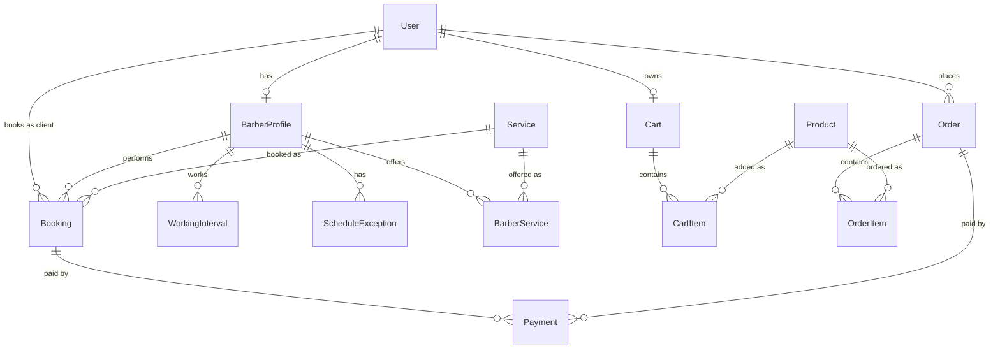
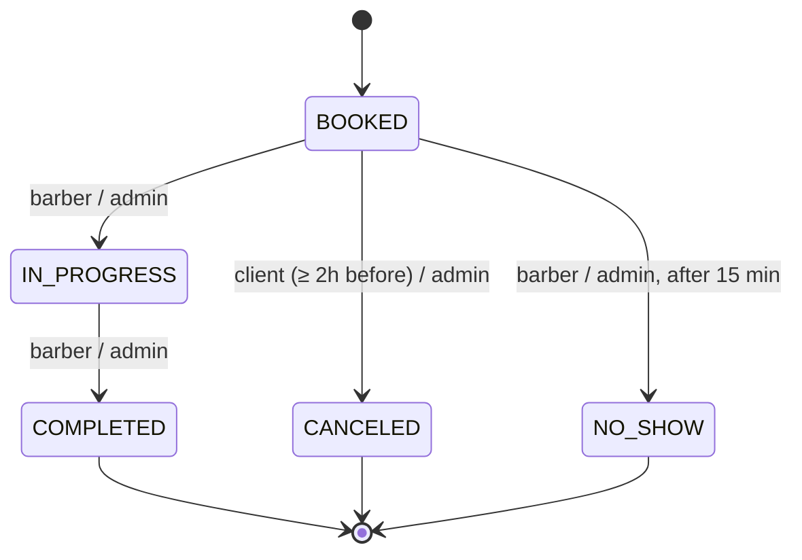
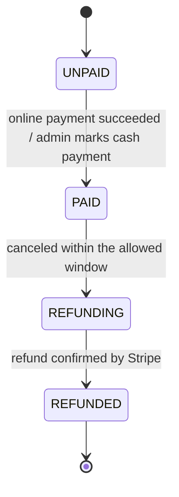
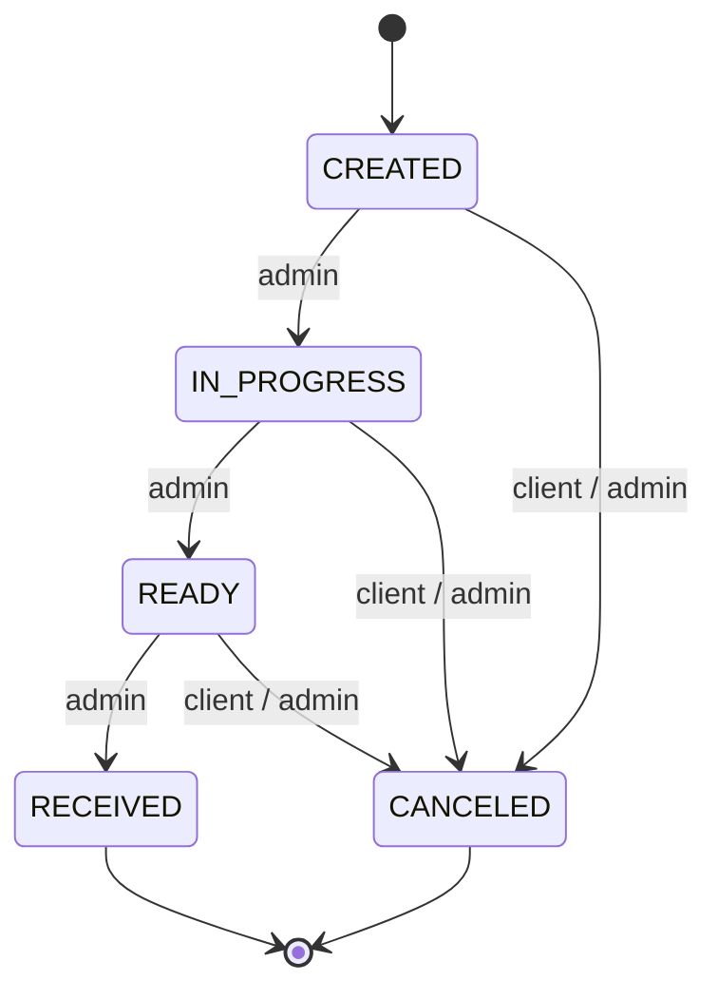
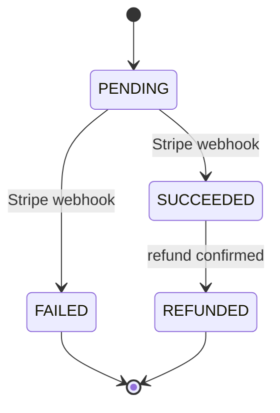

# Data model

## 1. Overview

## 2. Entities

Every entity has `id` (uuid, auto), `createdAt` and `updatedAt` (timestamp).
They are omitted from the tables below.

### User

Any person in the system: client, barber, administrator or owner.

| Field | Type | Required | Notes |
|-------|------|:--------:|-------|
| firstName | string | ✓ | |
| lastName | string | ✗ | Often unknown for records created by phone |
| phoneNumber | string | ✓ | Unique |
| email | string | ✗ | Unique |
| passwordHash | string | ✗ | Empty for client records created by an administrator |
| role | enum | ✓ | `CLIENT`, `BARBER`, `ADMIN`, `OWNER`; default `CLIENT` |
| isActive | boolean | ✓ | Default `true` |

### BarberProfile

Public part of a barber, shown to clients.

| Field | Type | Required | Notes |
|-------|------|:--------:|-------|
| userId | uuid | ✓ | → User; unique |
| photoUrl | string | ✗ | Link to the file in S3 |
| bio | text | ✗ | |

### Service

Shop-wide service catalog.

| Field | Type | Required | Notes |
|-------|------|:--------:|-------|
| name | string | ✓ | Unique |
| description | text | ✗ | |
| duration | integer | ✓ | Minutes, multiple of 15 |
| isActive | boolean | ✓ | Default `true` |

### BarberService

A service as offered by a specific barber, with their price.

| Field | Type | Required | Notes |
|-------|------|:--------:|-------|
| barberId | uuid | ✓ | → BarberProfile |
| serviceId | uuid | ✓ | → Service |
| price | integer | ✓ | Grosze |

Unique: `(barberId, serviceId)`.

### WorkingInterval

One continuous working time range of a barber on a given weekday.
The weekly schedule is the set of all intervals; a lunch break is the gap between two of them.

| Field | Type | Required | Notes |
|-------|------|:--------:|-------|
| barberId | uuid | ✓ | → BarberProfile |
| dayOfWeek | enum | ✓ | `MONDAY` … `SUNDAY` |
| startTime | time | ✓ | Local shop time (Europe/Warsaw) |
| endTime | time | ✓ | Local shop time (Europe/Warsaw) |

### ScheduleException

A one-time override of the weekly schedule on a specific date.

| Field | Type | Required | Notes |
|-------|------|:--------:|-------|
| barberId | uuid | ✓ | → BarberProfile |
| date | date | ✓ | Local calendar date |
| type | enum | ✓ | `BLOCKING`, `ADDITIONAL` |
| startTime | time | ✗ | Local shop time; empty together with `endTime` = whole day |
| endTime | time | ✗ | Local shop time |

### Booking

A client's appointment with a barber for one service.

| Field | Type | Required | Notes |
|-------|------|:--------:|-------|
| clientId | uuid | ✓ | → User |
| barberId | uuid | ✓ | → BarberProfile |
| serviceId | uuid | ✓ | → Service |
| startAt | timestamp | ✓ | UTC |
| endAt | timestamp | ✓ | UTC; `startAt` + duration + 15-minute buffer |
| status | enum | ✓ | `BOOKED`, `IN_PROGRESS`, `COMPLETED`, `CANCELED`, `NO_SHOW`; default `BOOKED` |
| paymentStatus | enum | ✓ | `UNPAID`, `PAID`, `REFUNDING`, `REFUNDED`; default `UNPAID` |
| priceSnapshot | integer | ✓ | Grosze; barber's price at booking time |
| durationSnapshot | integer | ✓ | Minutes; service duration at booking time |
| reminderSentAt | timestamp | ✗ | Empty until the reminder is sent |

### Payment

One online payment attempt through Stripe, for a booking or an order.
Payments made in cash at the shop create no record here.

| Field | Type | Required | Notes |
|-------|------|:--------:|-------|
| bookingId | uuid | ✗ | → Booking |
| orderId | uuid | ✗ | → Order |
| amount | integer | ✓ | Grosze |
| stripePaymentIntentId | string | ✓ | Unique |
| status | enum | ✓ | `PENDING`, `SUCCEEDED`, `FAILED`, `REFUNDED`; default `PENDING` |

### Product

Retail product in the shop catalog.

| Field | Type | Required | Notes |
|-------|------|:--------:|-------|
| name | string | ✓ | Unique |
| description | text | ✓ | |
| price | integer | ✓ | Grosze |
| stock | integer | ✓ | ≥ 0 |
| photoUrls | string[] | ✓ | Default `[]`; the first one is shown in the catalog |
| isActive | boolean | ✓ | Default `true` |

### Cart

A user's shopping cart, shared between web and mobile.

| Field | Type | Required | Notes |
|-------|------|:--------:|-------|
| userId | uuid | ✓ | → User; unique |

### CartItem

| Field | Type | Required | Notes |
|-------|------|:--------:|-------|
| cartId | uuid | ✓ | → Cart |
| productId | uuid | ✓ | → Product |
| quantity | integer | ✓ | ≥ 1 |

Unique: `(cartId, productId)`.

### Order

| Field | Type | Required | Notes |
|-------|------|:--------:|-------|
| clientId | uuid | ✓ | → User |
| status | enum | ✓ | `CREATED`, `IN_PROGRESS`, `READY`, `RECEIVED`, `CANCELED`; default `CREATED` |
| paymentStatus | enum | ✓ | `UNPAID`, `PAID`, `REFUNDING`, `REFUNDED`; default `UNPAID` |
| totalPrice | integer | ✓ | Grosze; snapshot, sum of items at order time |

### OrderItem

| Field | Type | Required | Notes |
|-------|------|:--------:|-------|
| orderId | uuid | ✓ | → Order |
| productId | uuid | ✓ | → Product |
| quantity | integer | ✓ | ≥ 1 |
| priceSnapshot | integer | ✓ | Grosze; price of one unit at order time |

## 3. Lifecycles

### Booking status

### Booking and order payment status

### Order status

### Payment attempt status

## 4. Cross-cutting decisions

**Identifiers.** Every entity uses a UUID primary key, so IDs in URLs do not reveal volumes.

**Time.** Moments (`startAt`, `endAt`, `createdAt`, `updatedAt`, `reminderSentAt`) are stored
in UTC as `timestamp` with time zone. Times of day in the weekly schedule and exceptions are
stored as `time` in local shop time (Europe/Warsaw), so that daylight saving changes do not
shift the schedule. Conversion to local time happens only when displaying.

**Money.** All amounts are integers in grosze (6000 = 60.00 zł). Floating-point types are never used.

**Deletion.** Users, services and products are never deleted, only deactivated via `isActive`,
because historical bookings and orders reference them.
Exception: `BarberService` rows are deleted physically — nothing references them, since bookings
reference `Service` and `BarberProfile` directly and keep the price as a snapshot.

**Snapshots.** A reference answers "what was it"; a snapshot answers "on what terms".
Bookings store the price and duration at booking time; order items store the unit price;
orders store the total. Later catalog changes never affect existing records.

**Payment status vs. payment attempts.** `paymentStatus` on bookings and orders is the source
of truth shown in the interface. `Payment` records only online attempts through Stripe;
a cash payment at the shop is recorded by an administrator setting `paymentStatus` to `PAID`.

## 5. Invariants

| Invariant | Enforced by |
|-----------|-------------|
| Phone number is unique; email is unique when present | Database (unique) |
| A user has at most one barber profile and one cart | Database (unique `userId`) |
| A barber offers each service at most once | Database (unique `barberId, serviceId`) |
| A product appears at most once per cart | Database (unique `cartId, productId`) |
| Service and product names are unique | Database (unique) |
| Stripe payment intent ID is unique | Database (unique) |
| Bookings of one barber never overlap, ignoring `CANCELED` bookings | Database (exclusion constraint, raw SQL migration) |
| Product stock is never negative | Database (check) |
| A payment references exactly one of booking or order | Database (check) |
| Quantities are ≥ 1; prices and amounts are ≥ 0 | Database (check) |
| A barber profile exists only for users with role `BARBER` | Code |
| Working interval `startTime < endTime`; intervals of one barber on one day do not overlap | Code |
| Exception times are both empty or both set, with `startTime < endTime` | Code |
| An `ADDITIONAL` exception always has times | Code |
| Service duration is a multiple of 15 minutes | Code |
| A booking lies inside the barber's available hours, not in the past, at most 30 days ahead | Code |
| Status transitions follow the lifecycles above; terminal statuses never change | Code |
| Order `totalPrice` equals the sum of its items at creation | Code |
